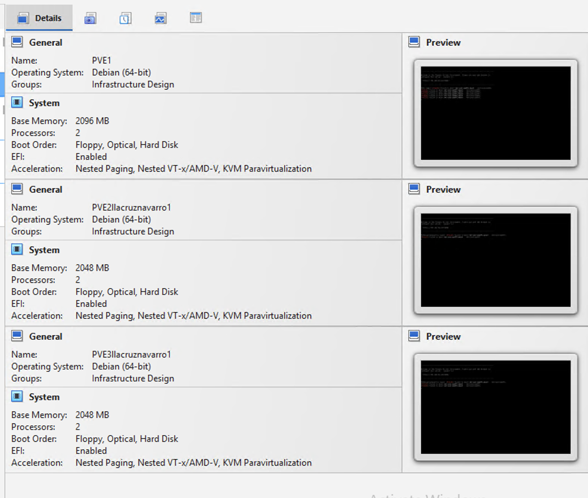
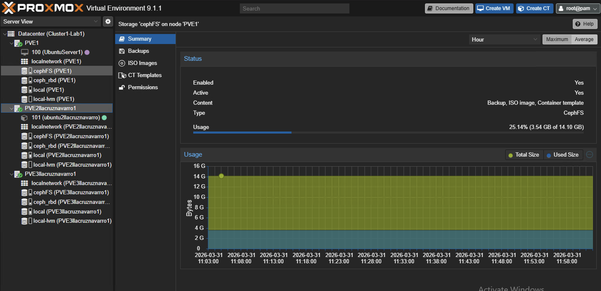

# Infrastructure Lab — 3-Node Proxmox Cluster with Ceph Storage

> Hands-on university infrastructure lab completed at Georgia State University. Configured a 3-node Proxmox VE cluster using nested virtualization, deployed Ceph distributed storage across all nodes, and provisioned Ubuntu Server VMs for service hosting. This repository documents the architecture, configuration steps, and key takeaways.

---

## Project Overview

| Detail | Info |
|--------|------|
| **Context** | System Administration course — Georgia State University |
| **Platform** | Proxmox VE |
| **Environment** | Nested virtualization — 3 Proxmox nodes running as VMs on a Windows 11 host (Oracle VirtualBox) |
| **Cluster Name** | Cluster1-Lab1 |
| **Nodes** | PVE1, PVE2llacruznavarro1, PVE3llacruznavarro1 |
| **Storage** | Ceph distributed storage (cephFS + ceph_rbd) + local storage per node |
| **VMs Deployed** | 2 Ubuntu Server instances + additional Linux VMs planned |

---

## Architecture


### Environment Layout

```
Windows 11 Host (Oracle VirtualBox — provided by professor)
└── Nested Virtualization
    ├── PVE1 (Proxmox Node 1) — 192.168.56.101
    │   ├── VM 100: UbuntuServer1
    │   ├── Storage: local, local-lvm
    │   └── Network: LocalNetwork
    │
    ├── PVE2llacruznavarro1 (Proxmox Node 2) — 192.168.56.102
    │   ├── VM 101: Ubuntu2
    │   ├── Storage: local, local-lvm
    │   └── Network: LocalNetwork
    │
    └── PVE3llacruznavarro1 (Proxmox Node 3) — 192.168.56.103
        ├── VMs: (none yet — available for future deployments)
        ├── Storage: local, local-lvm
        └── Network: LocalNetwork

Shared Storage: Ceph (cephFS + ceph_rbd) across all 3 nodes
```

### Cluster Nodes

| Node | Hostname | IP Address | Storage | VMs |
|------|----------|------------|---------|-----|
| Node 1 | PVE1 | 192.168.56.101 | local, local-lvm, cephFS, ceph_rbd | VM 100: UbuntuServer1 |
| Node 2 | PVE2llacruznavarro1 | 192.168.56.102 | local, local-lvm, cephFS, ceph_rbd | VM 101: Ubuntu2 |
| Node 3 | PVE3llacruznavarro1 | 192.168.56.103 | local, local-lvm, cephFS, ceph_rbd | Available |

### Virtual Machines

| VM ID | Name | Node | OS | Status | Services Running |
|-------|------|------|----|--------|-----------------|
| 100 | UbuntuServer1 | PVE1 | Ubuntu Server | Stopped | MariaDB, PostgreSQL |
| 101 | Ubuntu2 | PVE2 | Ubuntu Server | Running | MySQL, Nginx |

---

## What I Configured

### Proxmox Cluster
- Joined 3 Proxmox VE nodes into a single cluster (Cluster1-Lab1)
- Configured cluster communication between nodes on the 192.168.56.0/24 network
- Managed VMs across the cluster through the Proxmox web interface

### Ceph Distributed Storage
- Deployed Ceph across all 3 nodes, creating a shared storage pool accessible from any node
- Configured both **cephFS** (file-level storage) and **ceph_rbd** (block-level storage)

### Ubuntu Server VMs
- Provisioned Ubuntu Server instances on Node 1 and Node 2
- Configured the following services across the VMs:
  - **MariaDB** — relational database
  - **PostgreSQL** — relational database
  - **MySQL** — relational database
  - **Nginx** — web server / reverse proxy

### Networking
- All nodes connected on the 192.168.56.0/24 subnet
- Each node has a LocalNetwork configuration
- All nodes can communicate with each other across the cluster
- Bridges configured for each node to enable VM networking

---

## Screenshots


*Proxmox web UI showing all 3 nodes in Cluster1-Lab1*


*Ceph distributed storage status across the cluster*
---

## What I Learned

- **Nested virtualization** adds a level of abstraction that caught me by surprise. This type of architecture is meant for enterprise-level networks that in most cases would have dedicated physical servers for each node. Understanding the overhead and limitations of nesting was an important lesson.

- **Ceph distributed storage** and tools like it are essential when looking to build a robust storage solution without breaking the bank. You get a powerful, redundant file system by leveraging already available computing power across a corporate network.

- **The hardest part was configuring the networking.** Not because of the complexity of the task itself, but rather the importance of really focusing on repetitive configuration tasks that have a big impact if misconfigured. One wrong IP or bridge setting can break cluster communication entirely.

---

## What I Am Looking to Implement Next

- [ ] Deploy a Windows Server VM with Active Directory, DNS, and DHCP
- [ ] Add network segmentation with VLANs between VM groups
- [ ] Set up monitoring with a tool like Zabbix or Uptime Kuma
- [ ] Test VM live migration between nodes using Ceph shared storage
- [ ] Begin writing Python scripts to automate VM health checks

---

## Technologies Used

- **Oracle VirtualBox** — Hypervisor running on the Windows 11 host
- **Proxmox VE** — Open-source virtualization and cluster management
- **Ceph** — Distributed storage system (cephFS + RBD)
- **Ubuntu Server** — Linux VM deployments
- **MariaDB / PostgreSQL / MySQL** — Database servers
- **Nginx** — Web server and reverse proxy
- **draw.io** — Network diagrams

---

## Contact

**Luis Lacruz**
- LinkedIn: [linkedin.com/in/luis-lacruz](https://www.linkedin.com/in/luis-lacruz/)
- Email: Sebaslacruz2@gmail.com
